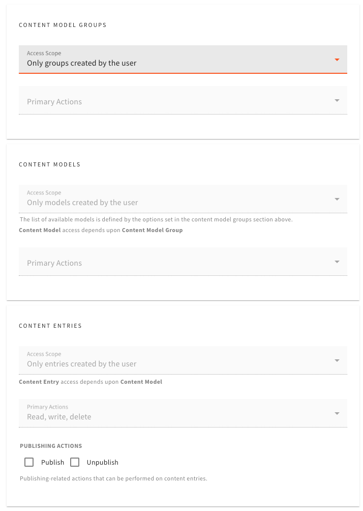
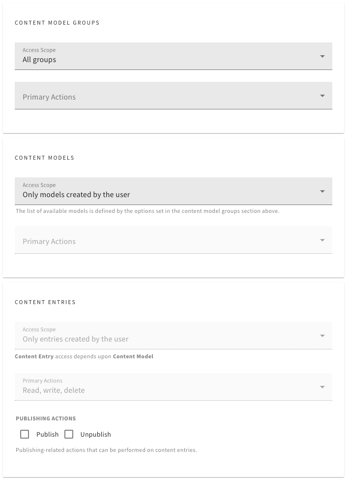

# How Access Control Works

With Headless CMS, checking base permissions (access control) is a bit more interesting because the three types of permissions objects are related to each other. The three types of permissions are:

1. `cms.contentModelGroup`
2. `cms.contentModel`
3. `cms.contentEntry`

So, for example, when checking if a user can create content entries, it's not enough to check if the user has the `cms.contentEntry` permission. We also need to check if the user has the `cms.contentModel` permission for the content model the entry belongs to, and if the user has the `cms.contentModelGroup` permission for the content model group the content model belongs to.

All of the above is handled by the `AccessControl` class, which provides a set of methods to check if a user has the necessary permissions to perform a specific action. The main methods that are used in CRUD operations-related code are:

1. `canAccessGroup` (`ensureCanAccessGroup`): checks if a user has the necessary permissions to access a content model group.
2. `canAccessModel` (`ensureCanAccessModel`): checks if a user has the necessary permissions to access a content model (takes into consideration the content model group permissions).
3. `canAccessEntry` (`ensureCanAccessEntry`): checks if a user has the necessary permissions to access a content entry (takes into consideration the content model and content model group permissions).

Note that all of these methods can accept an exact entity instance if needed, but it's not required. Both has its own use cases. 

For example, when checking if a user can access (read) a content entry, you can pass the entry instance to the `canAccessEntry` method, and it will check if the user has the necessary permissions to access that specific entry. On the other hand, if the entry instance was not passed, the method would check if the user has the necessary permissions to access (read) entries of the given content model. 

Note that, whenever possible, the entry should be passed to the method, as it's more secure and provides more accurate results. For example, it is possible to receive a `true` response when checking if a user can access a specific content model, but still receive `false` when the model was not passed (when checking if user can access / read models in general). 

## Folder Level Permissions

With Folder Level Permissions, a user can be part of a team, that may have multiple roles that provide different Headless CMS-related permissions (more information [here](https://www.webiny.com/docs/enterprise/aacl/teams#overview)). 

The Access Control class is aware of this and ensures that only permissions objects from a single role are taken into consideration when checking if a user has the necessary permissions to perform a specific action. If permission objects from a single role do not provide the necessary permissions, the next role is checked, and so on.

In order to achieve this, we're using the `_src` property that's assigned to each permission object. This property contains the role ID, and is used to filter out permissions objects that belong to a different role.

## Interesting Permissions-related Logic

### Only groups created by the user

When choosing "Only groups created by the user" access scope via the `cms.contentModelGroup` permission, the user that possesses this permission can not only fully (r/w/d) access content models that belong to the content model groups that the user has created, but also content entries that belong to those content models.

Note that only the entry publishing actions-related permissions are not automatically set here. They need to be defined when defining the role explicitly.

### Only models created by the user

When choosing "Only models created by the user" access scope via the `cms.contentModel` permission, the user that possesses this permission can not only fully (r/w/d) access content models that the user has created, but also content entries that belong to those content models.

Note that only the entry publishing actions-related permissions are not automatically set here. They need to be defined when defining the role explicitly.